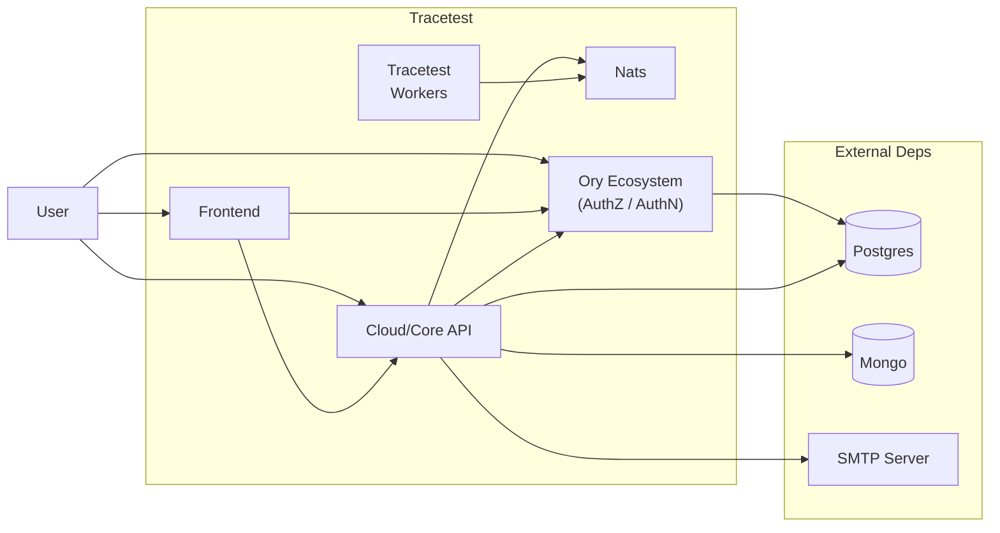

> [!NOTE]
> This file is kept just to generate a PNG image with the architecture of the OnPrem installation. The content is not used in the documentation.
> To generate the graph, go to https://mermaid.live, copy the content and save the image as `onprem-architecture.png`

