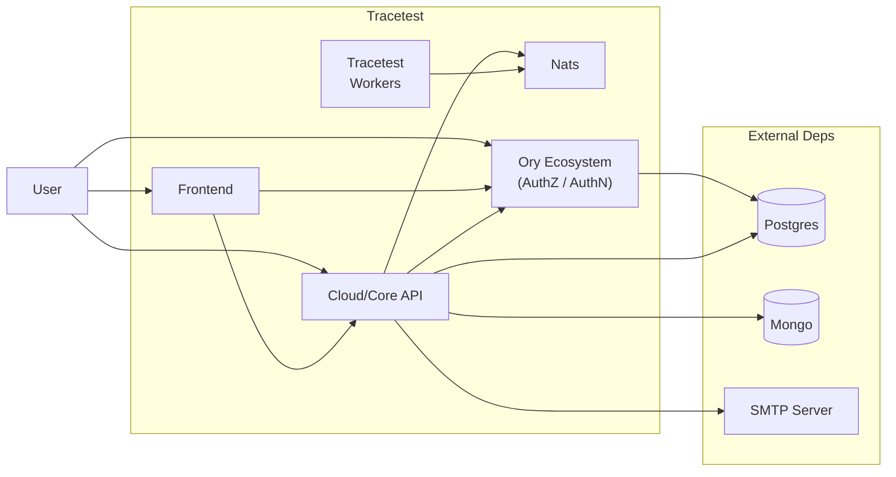

# Pre-requisites to Install Tracetest OnPrem

Tracetest is composed of a few different internal services to properly work. These services are:
- **Frontend**: WebUI used to interact with the Tracetest, allowing users to [create and manage tests](https://docs.tracetest.io/web-ui/creating-tests).
- **Cloud/Core API**: APIs that are called directly by the Frontend, the Tracetest CLI and the Tracetest Agent to perform operations on the systems, like creating and running tests.
- **Ory Ecosystem**: Tracetest relies on the [Ory Ecosystem](https://www.ory.sh/) for authentication and authorization. This includes [Ory Kratos](https://www.ory.sh/kratos/docs/), [Ory Keto](https://www.ory.sh/keto/docs/), and [Ory Oathkeeper](https://www.ory.sh/oathkeeper/docs/).
- **Tracetest Workers**: A set of workers that manage the test execution.
- **Nats**: An instance of [nats.io](https://nats.io/) uses a message broker that works as a communication bridge between the different services.

To simplify access to the different parts of Tracetest for a user (that mostly will use the CLI and Web UI), we recommend our users rely on a proxy, like [Traefik](https://traefik.io/traefik/) to have a single entrypoint to handle connections to the Frontend and APIs.

Also, all incoming connections are secured using HTTPS/TLS. Tracetest relies on [cert-manager](https://cert-manager.io) to create and maintain certificates.
Cert-manager is a complete solution for managing certificates in an automated way. By default, Tracetest comes preconfigured with a self-signed certificate.
While this is secure enough for testing, it will create warnings to users accessing the Web UI in most browsers.

We recommend configuring a production-ready [Issuer](https://cert-manager.io/docs/configuration/issuers/) for cert-manager to provide the best user experience and security.

## Exposure to CLI and Web clients

Tracetest doesn't require exposure to the public internet. However, clients will need to be able to communicate with the Tracetest services. By clients we mean CLI on developer machines, CI/CD actions, and even the Web UI on the user's machine.

The simplest solution is to rely on the [Kubernetes LoadBalancer](https://kubernetes.io/docs/concepts/services-networking/) to expose the Traefik Proxy that Tracetest uses.

This does not mean that your Tracetest instance needs to be accessible from the public internet. Depending on your cloud infrastructure, you can have clusters that are only accessible from the VPC,
allowing permitted clients to access via VPN, for example. There are endless ways to configure Kubernetes, and it is outside the scope of this documentation.